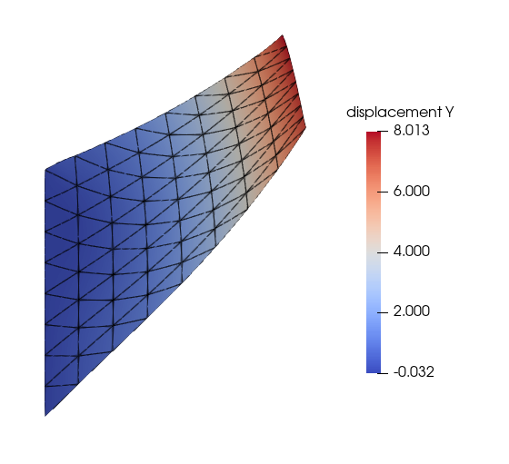
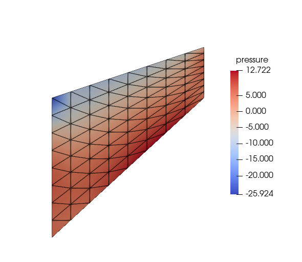
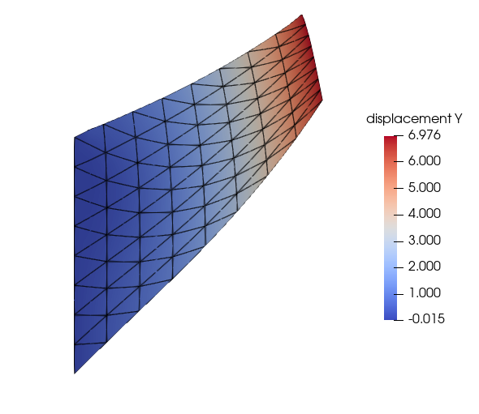
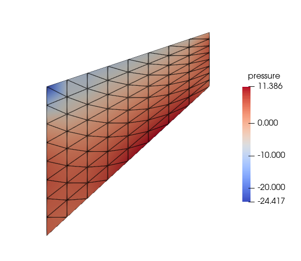
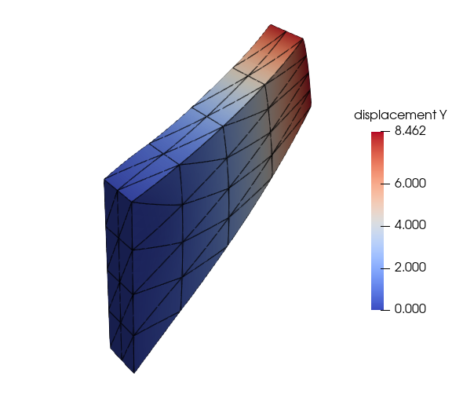
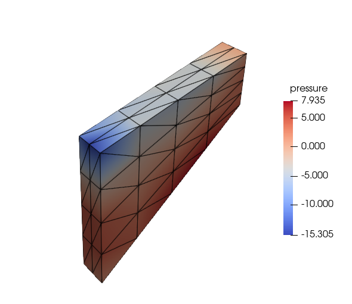
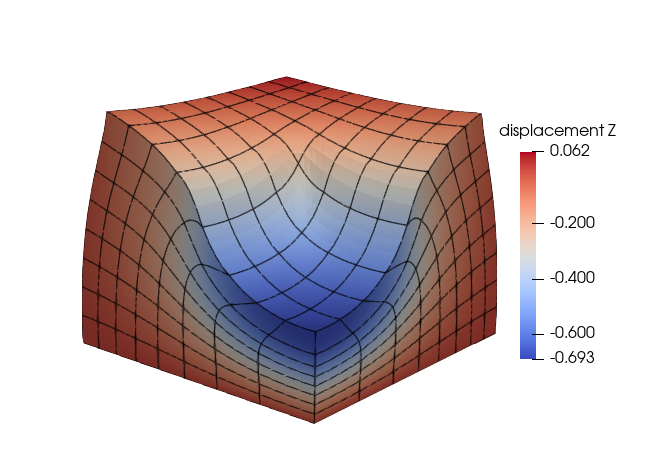
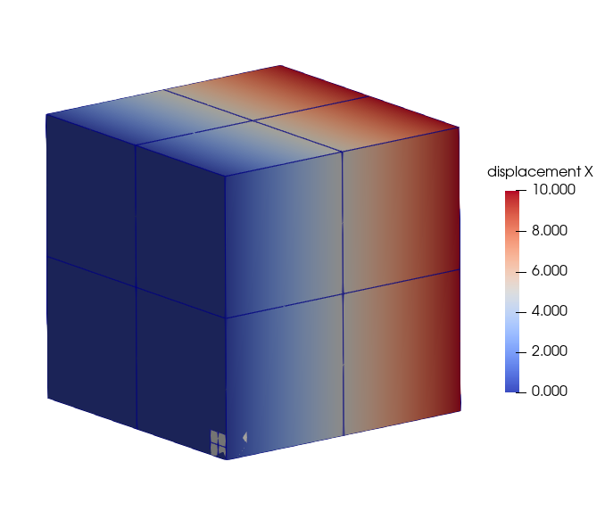
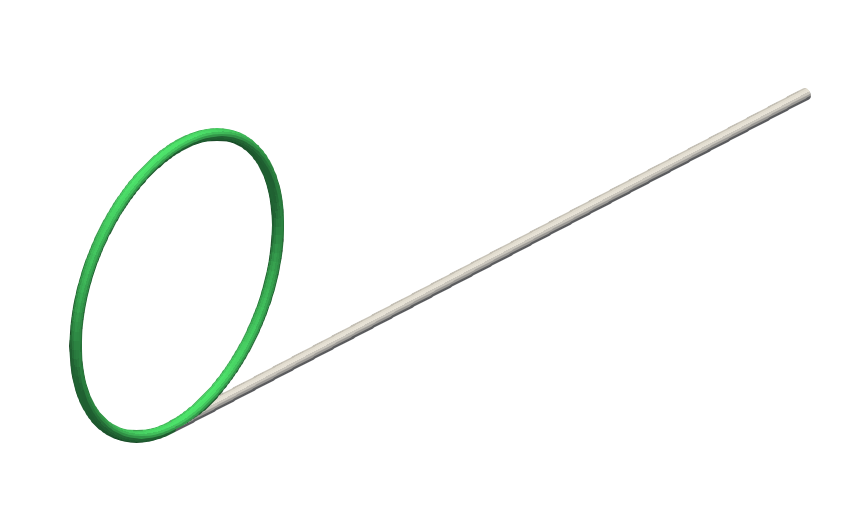
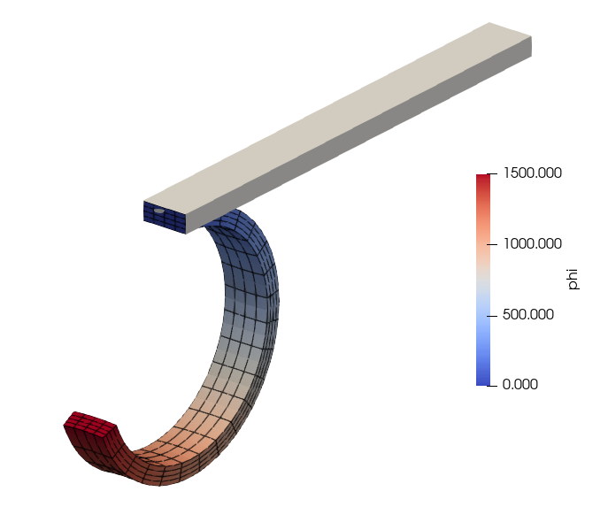

# ElasticityWithFEniCSx

This repository contains source files (Python scripts) for solving elasticity problems using FEniCSx library, the new version of FEniCS.

The input meshes are generated using **GMSH** and used directlyy using the function `gmshio.read_from_msh()` instead of converting to the **XML** format.

Some of the example problems solved are shown below.

## Linear and Hyperelasticity
### Linear elasticity
#### Cook's membrane in plane-strain condition

### Hyperelasticity

#### Cook's membrane in plane-strain condition

#### Cook's membrane in 3D

#### Block 3D

## Morphoelasticity - Growth-driven deformations

#### Dilatation of a Cube

#### Deformation of rods

## Magnetomechanics

#### Softmagnetic beam

